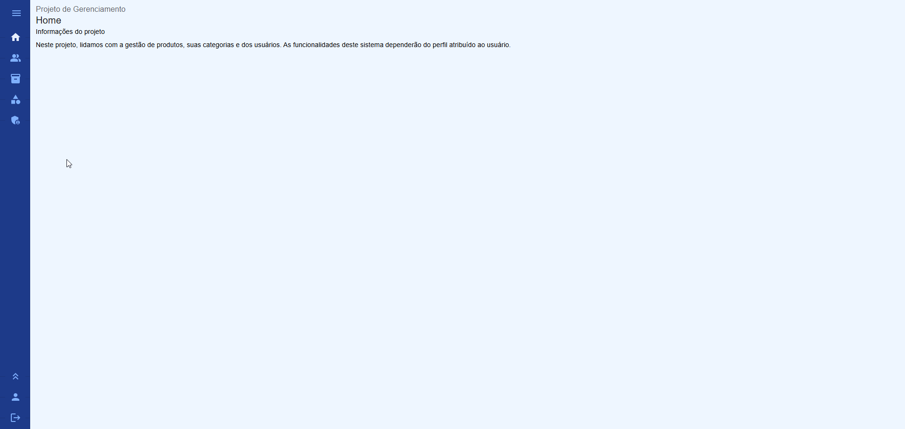
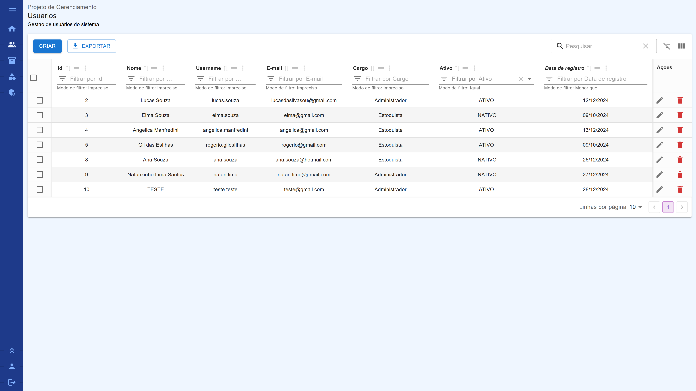
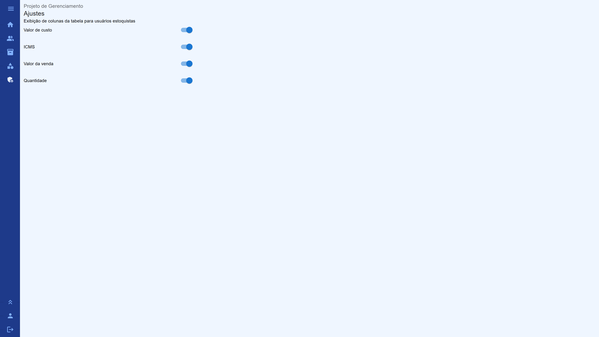
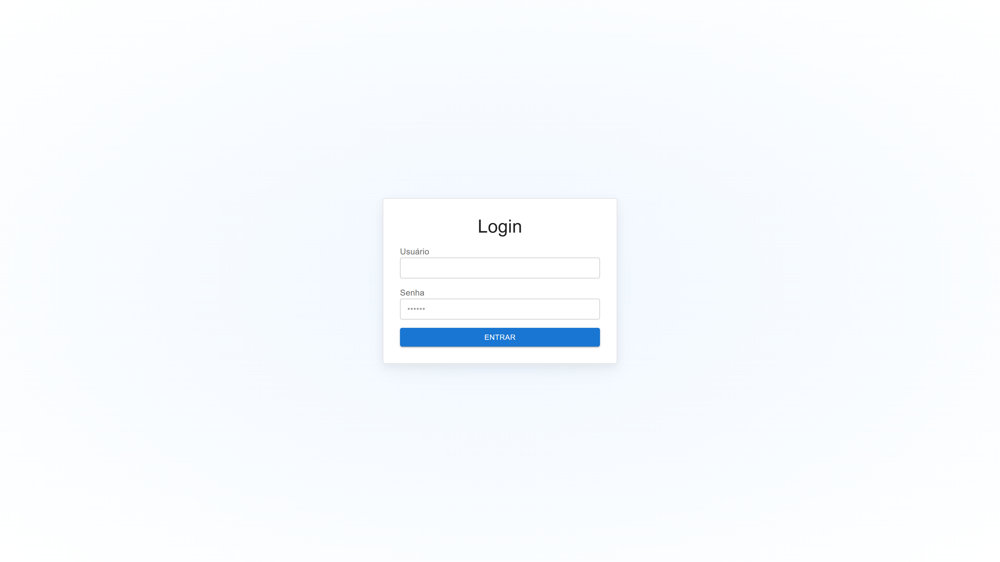
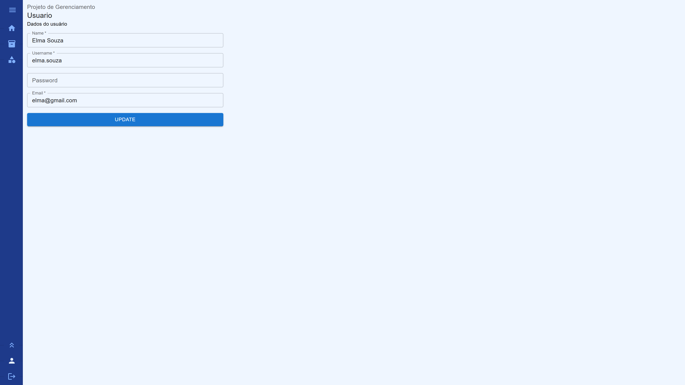
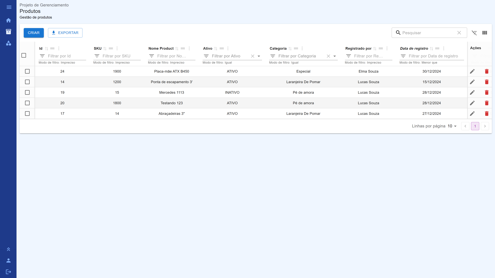
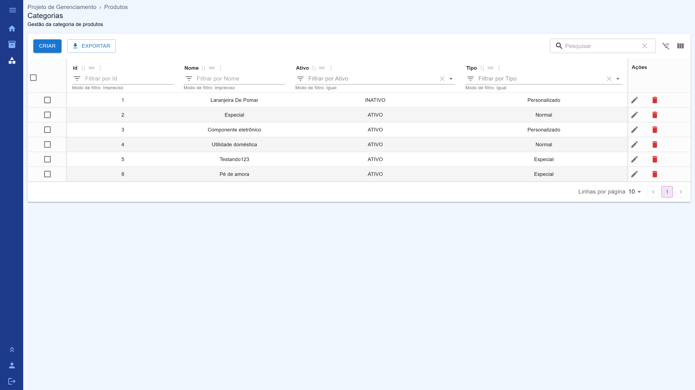

# Desafio - B7 Assessoria
## Frontend

Project proposed by B7 Assessoria for the control of users, products and their categories.

## Features
### Administrators
- Create, read, update and delete users data, defining standart password "123456";
- Can change the visibility of columns for stock workers.

### Both users
- Create, read, update and delete products data. Stock workers depends the availability of columns;
- Create, read, update and delete products categories data.
- Change the own user info (limited for name, username, password and email);
- Can logout.

### Observations
We're using Material React Tables, lib based in Material UI who give functionalities for tables, like as:
- Export all table rows or selected lines; 
- CRUD operations
- Ordering columns.

In this system, disregarding GET requests, all users can create, edit and delete one line at a time. In future, we can open the possibility for INSERT and UPDATE operations within many lines.

All pages are responsive for smartphones, tablets, laptops and desktops, respecting the Mobile First concepts.

## Libs
- React.js (v18)
- Redux and React-Redux
- React Router
- Material UI (styling)
- Axios (API requests)
- Xlsx and export-to-csv (for export to CSV and XLSX)
- React IMask (mask for brazilian number standart)

## Instructions
- Download [Node.js](https://nodejs.org/en/download)
- Clone this repository;
- Access the cloned project in the terminal and type `npm i` for download the dependencies;
- After, start using the command `npm start`.

## Pages
All texts are available in Portuguese of Brazil.

### Menu

### Exclusive for admins

### Both users

